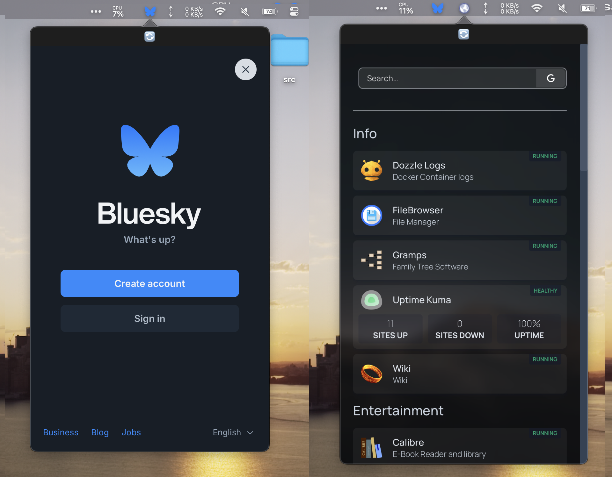

# MenuSite

A macOS menu bar app that displays websites in mobile view. Perfect for monitoring dashboards, social media, or any web service directly from your menu bar.



## Features

- 🌐 **Multiple website viewers** - Run several instances simultaneously
- 📱 **Mobile rendering** - Websites display in mobile format for compact viewing
- 🎨 **Smart icons** - Automatically fetches website favicons or use custom images
- 🔗 **Link handling** - Toggle between internal navigation or opening links externally
- ⚙️ **Customizable** - Adjust window size, URL, and behavior per instance
- 🚫 **No dock clutter** - Lives purely in your menu bar

## Installation

### Option 1: Download Pre-built App
1. Go to [Releases](https://github.com/yourusername/menusite/releases)
2. Download the latest `menusite-macos.zip`
3. Unzip and drag `menusite.app` to Applications folder
4. **Important**: Right-click → "Open" on first launch (unsigned app security requirement)

### Option 2: Build from Source
```bash
git clone https://github.com/yourusername/menusite.git
cd menusite
open menusite.xcodeproj
# Build and run in Xcode (⌘+R)
```

## Usage

1. **Click** the menu bar icon to open/close the website viewer
2. **Right-click** the menu bar icon for options:
   - Toggle external link behavior
   - Access settings
   - Create new viewers
   - Refresh or close

3. **Settings** allow you to:
   - Change website URL
   - Customize window dimensions
   - Upload custom icons
   - Configure link handling

## Requirements

- macOS 11.0 or later
- Internet connection for website loading

## Use Cases

- **Developer dashboards** - Monitor CI/CD, analytics, or admin panels
- **Social media** - Quick access to Twitter, LinkedIn, etc.
- **System monitoring** - Keep an eye on server status pages
- **Personal productivity** - Todo lists, calendars, or note-taking apps
- **News & updates** - Stay informed without browser tabs

## Known Limitations

- App is unsigned (shows security warning on first launch)
- Some websites may not work properly in mobile view
- Login sessions may not persist between app restarts

## Contributing

1. Fork the repository
2. Create a feature branch (`git checkout -b feature/amazing-feature`)
3. Commit your changes (`git commit -m 'Add amazing feature'`)
4. Push to the branch (`git push origin feature/amazing-feature`)
5. Open a Pull Request

## License

This project is open source and available under the [MIT License](LICENSE).

## Support

If you encounter issues or have feature requests, please [open an issue](https://github.com/yourusername/menusite/issues).

---

**Made with ❤️ for the macOS community**